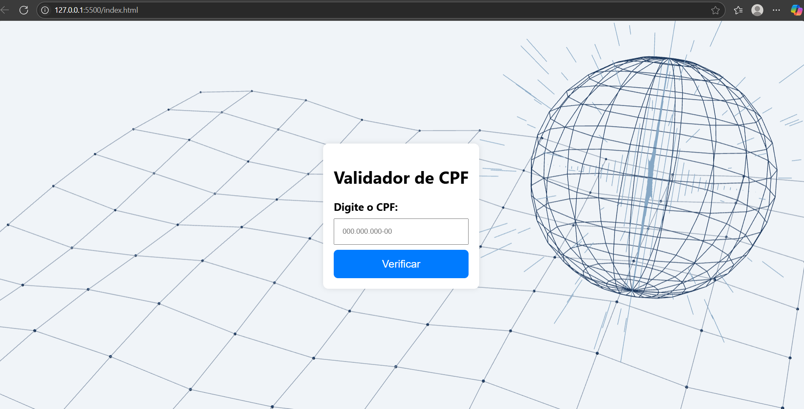

    # ValidaCPF

    Uma aplicação simples para validação de números de CPF (Cadastro de Pessoa Física) utilizando JavaScript. Este projeto foi desenvolvido com fins educacionais para praticar lógica de programação e manipulação de dados no front-end.

    ---

    ## 📸 Demonstração

    ---

    ## 📌 Funcionalidades

    - ✅ Validação de CPF com base nos dígitos verificadores
    - ✅ Interface simples e responsiva
    - ✅ Exibição imediata do resultado da validação

    ---

    ## 🚀 Tecnologias Utilizadas

    - HTML5
    - CSS3
    - JavaScript (puro)

    ---

    ## 📂 Estrutura do Projeto

    ValidaCPF/
    ├── index.html # Página principal
    ├── style.css # Estilo da aplicação
    └── script.js # Lógica de validação do CPF

    ---

    ## 🧠 Como Funciona a Validação?

    A lógica de validação segue o algoritmo oficial do CPF:

    1. Remove caracteres não numéricos.
    2. Verifica se todos os números são iguais (caso inválido).
    3. Calcula os dois dígitos verificadores com base nos primeiros 9 dígitos.
    4. Compara os dígitos calculados com os fornecidos.

    ---

## 👨‍💻 Desenvolvedor

  

  <b>Paulo Vinícius Carraro</b>

  
  
   

    ---

    ## 📄 Licença

Este projeto foi desenvolvido exclusivamente para fins educacionais como parte de uma atividade em sala de aula.  
Não possui fins lucrativos ou distribuição comercial.
